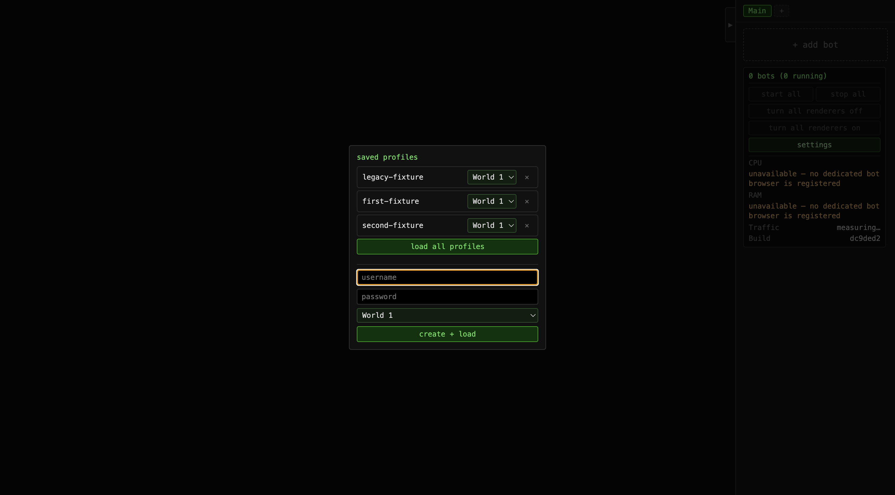
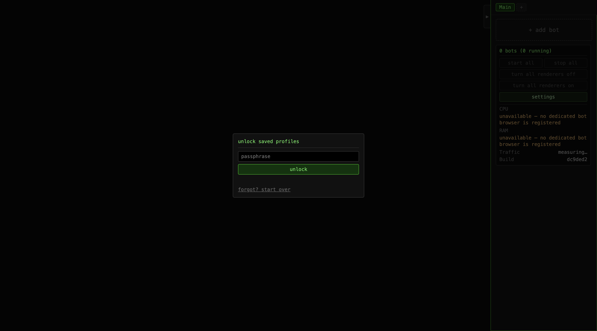

# Concurrent Electron instances

Run `bun e2e/desktop-instances-test.ts` from the repository root with desktop dependencies installed.
The harness uses temporary fixture accounts and makes no game login.

The recorded run used clean commit `dc9ded2f381c756a06a21483ed733b85b9bf4b5b` on ports 8083 and 8084.
Each launcher built into its own directory. Both Electron windows read and wrote one saved-data store.

The checks cover existing account/settings migration, simultaneous account additions, shared settings
inside bot frames, persistence after restart, unchanged shared build output, and independent shutdown.
Both screenshots show the migrated account and accounts added concurrently by the two windows.
The browser caches and private builds were removed at shutdown.

[Proof](proof.json) · [First launcher](launcher-1.log) · [Second launcher](launcher-2.log)

Path drawing exposed a regression in the shared storage bridge: every setting read blocked the renderer
on synchronous IPC and reread the saved JSON file. The preload now caches settings and accepts ordered
snapshots when saved data changes. Account reads and compare-and-set writes retain their concurrency checks.

The harness measures five `SettingsStore.globalBag()` resolutions per animation frame inside a real bot
iframe, over 60 frames with 22 settings per bag. These are settings lookup timings, not game FPS measurements.

| Version | Median work per frame | 95th percentile | Synchronous reads |
|---|---:|---:|---:|
| Before, `c0e98f4` | 8.56 ms | 9.75 ms | 6,622 |
| After, `dc9ded2` | 0.20 ms | 0.25 ms | 0 |

[Before measurement](settings-performance-before.json) · [After measurement](settings-performance.json)

The before run had only the new regression harness changed. It failed the zero synchronous reads assertion.
The after run passed that assertion, shared account edits, setting removals, and a rapid write/revert
while the main event loop held file notifications. A unit test checks that queued older snapshots cannot
overwrite a newer write response. Another checks compatibility with an already-running older desktop.

Validation for the fix: 82 focused tests passed, zero failures. Typecheck, ESLint, prose, API contract and
e2e boundary checks passed. The Electron harness passed on the clean commit above.

Older Electron windows must restart once with the updated launcher to use shared saved data.
Windows already using shared storage need a fresh `bun run b0t` launch for the performance fix.
