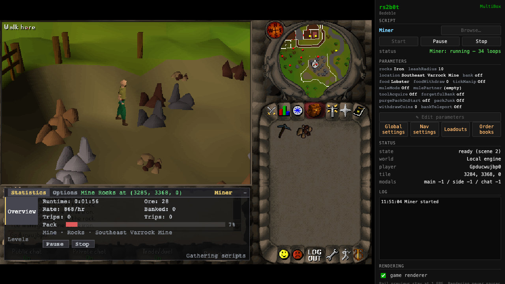
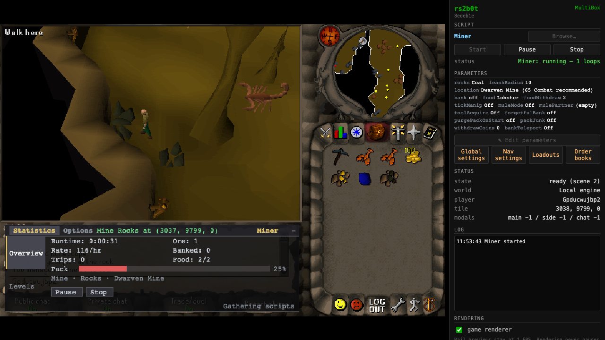

# Gathering batch drops

Use Miner, Fisher or Woodcutter with `Bank=false` to drop the gathered haul in a batch.
Miner keeps its existing ore and location choices. `Bank=true` continues to bank the haul.

The shared routine dispatches all eligible drops together, then waits for inventory confirmation.
It retries only remaining products, with a six-second confirmation window and at most three batches.
Mining matches exact selected ore names. Fishing keeps cooked food and tools. Knife-delay training
keeps one fletchable log. Power-mode food restocking reserves an ore slot and reports a space error
if the configured food and carried tools cannot fit.

Run `bun e2e/gathering-power-drop-test.ts` against the local test engine on port 8890.
The harness uses temporary fixture accounts and a private client build, preserving the bundle used
by an existing app. It checks seeded full inventories and a complete iron mining/drop cycle, then
requires mining XP and ore to increase after every drop. It checks clay at Rimmington and coal at
the Dwarven Mine with food and other supplies. `Pack junk=Off` isolates the haul dropper from junk cleanup.

The engine accepts five item actions per tick, so 27 ore require at least six ticks.
The historical Miner baseline used a separate wait per item and took 16.418 seconds, or 28 ticks.

The current run used clean commit `8edeb1e4b098c586182585dfbed86bcdcb7c61c1`.

| Case | Ore dropped | Confirmed time | Server ticks |
|---|---:|---:|---:|
| Miner baseline, Southeast Varrock | 27 iron | 16.418 s | 28 |
| Miner batch drop, Southeast Varrock | 27 iron | 3.230 s | 6 |
| Miner, naturally mined full inventory | 27 iron | 3.628 s | 6 |
| Miner, Rimmington | 27 clay | 3.293 s | 6 |
| Miner, Dwarven Mine | 22 coal | 2.825 s | 5 |

[Current proof](proof.json) · [Historical baseline](miner-baseline.json)

The 346 gathering tests cover all ten ore types, partial drops, bounded failures, food capacity,
raw fish, logs, and the knife-delay reserve. Typecheck, ESLint, prose and API contract checks passed.

