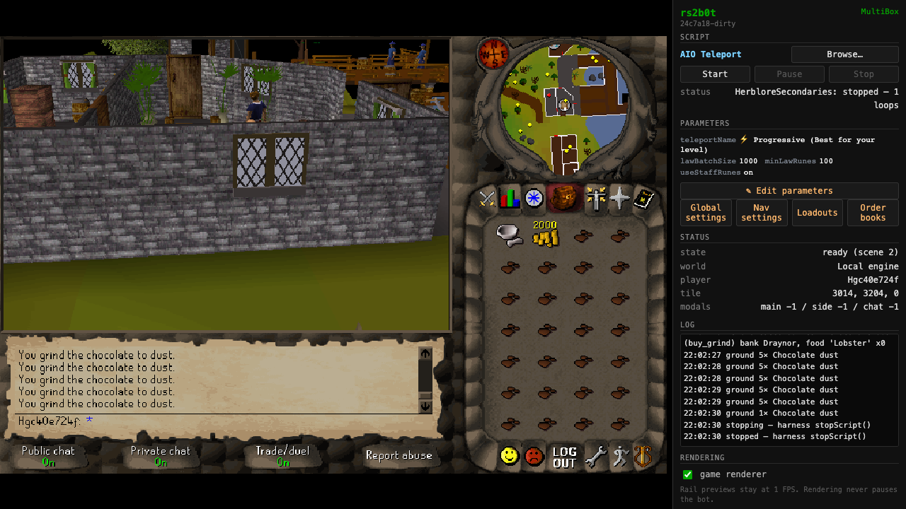
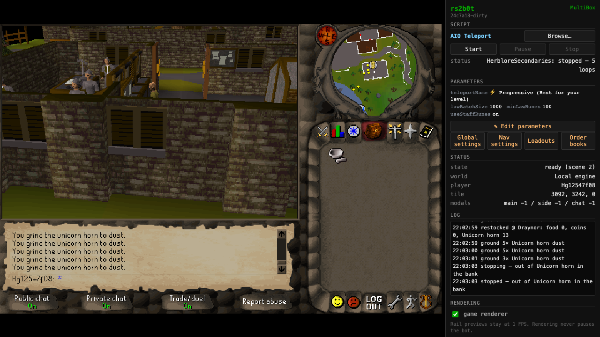

# Grind herblore secondaries

Select **Chocolate dust** or **Unicorn horn dust** in HerbloreSecondaries.
Keep a pestle and mortar available. Chocolate dust uses coins to buy bars at
Wydin's shop; unicorn horn dust withdraws horns from the bank and deposits the dust.

Grinding sends five item actions per game tick. The last batch uses the remaining
ingredients when fewer than five remain. Pending events, dialogs, an open bank,
or a missing tool stop the next batch.

## Verify against the local engine

With the local engine running at its normal 600 ms tick speed:

```sh
bun e2e/herblore-grinding-live.ts
```

The harness creates two accounts and measures inventory changes by server tick.
The September 29, 2026 run passed:

- Chocolate: 26 bars became dust in six consecutive ticks, `5, 5, 5, 5, 5, 1`.
- Unicorn horns: 40 horns were withdrawn in loads of 27 and 13, ground as
  `5, 5, 5, 5, 5, 2` and `5, 5, 3`, and all dust was deposited.
  The script stopped when the bank ran out of horns.
- Both accounts retained their pestle; gathered counts matched inventory changes.




